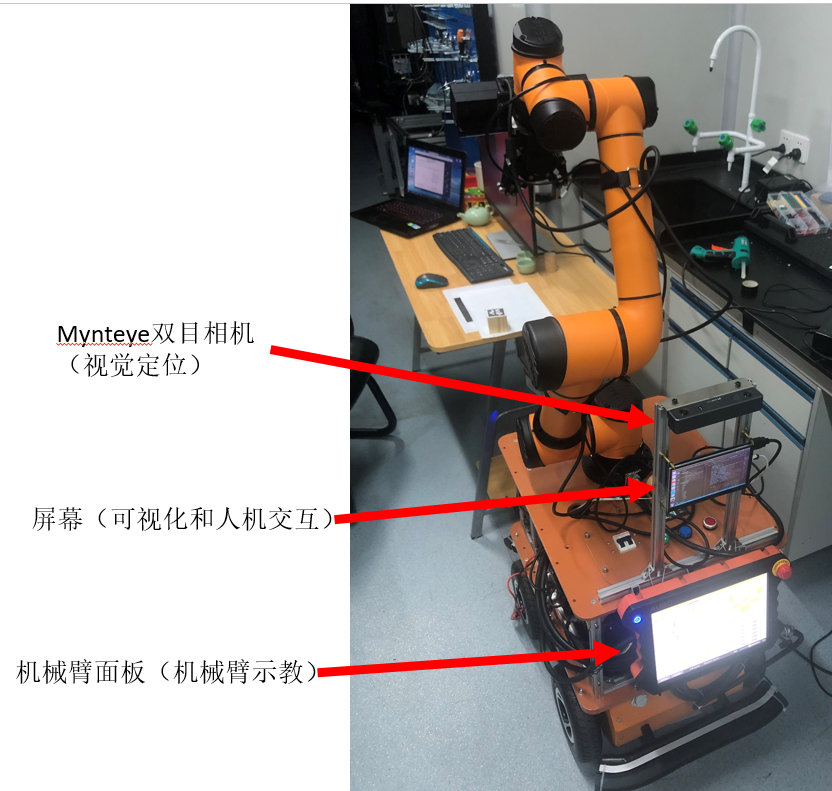
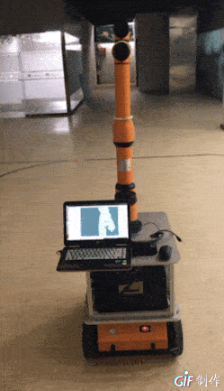
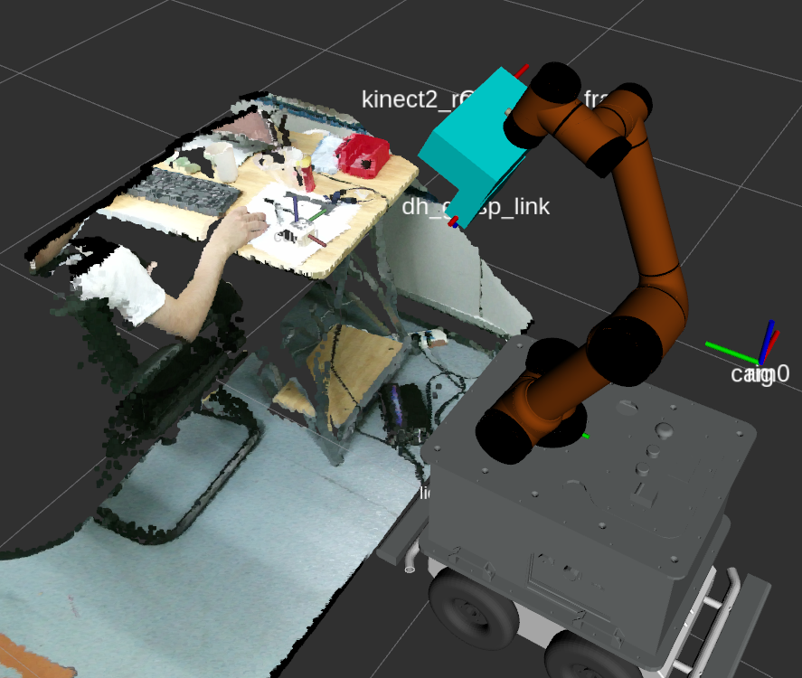
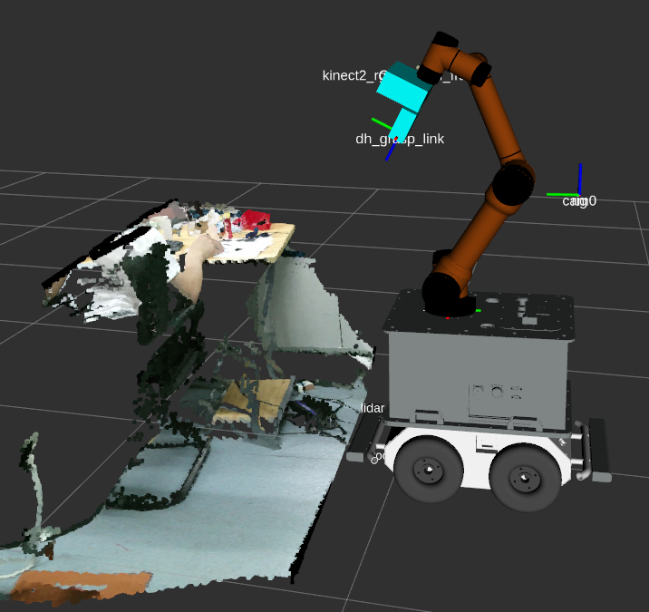
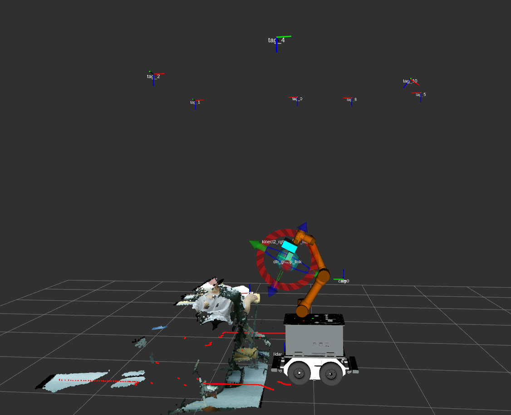

# IM(Intelligent Manufacture) Robot

This robot is combine car with arm.

--------------------------------

    作 者 : 王 培 荣

    版 本 : Ver1.0

    时 间 : 2020.05.20

    如欲合作，可wechat联系：13713917385
---------------------------------

实物图




机械图


urdf模型和手眼标定


SLAM建图



机械臂抓取


rgbd相机，单线雷达和tagslam结合定位导航





## 1 How to work
 
```
roslaunch thurobot move_grasp_robot.launch
```
  


## 2 All package about robot 

定位导航部分包含模块：

[tagslam_robot](https://github.com/MRwangmaomao/tagslam_robot)

[semantic_slam_nav_ros](https://github.com/MRwangmaomao/semantic_slam_nav_ros)

[MYNT-EYE-D-SDK](https://github.com/slightech/MYNT-EYE-D-SDK)

机械臂视部分包含模块：

[aubo_arm_usr](https://github.com/MRwangmaomao/aubo_arm_usr)

[aubo_robot](https://github.com/MRwangmaomao/aubo_robot)

[dh_hand_driver](https://github.com/MRwangmaomao/dh_hand_driver)

[apriltag_ros](https://github.com/MRwangmaomao/apriltag_ros)
  
[easy_handeye](https://github.com/MRwangmaomao/easy_handeye)

[easy_handeye](https://github.com/MRwangmaomao/find_cup_ros)

[visp_hand2eye_calibration](https://github.com/arushk1/visp_hand2eye_calibration)

[iai_kinect2](https://github.com/MRwangmaomao/iai_kinect2)