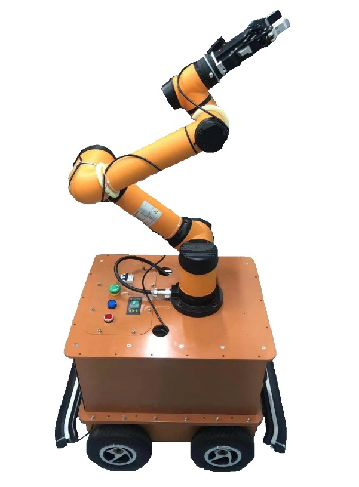
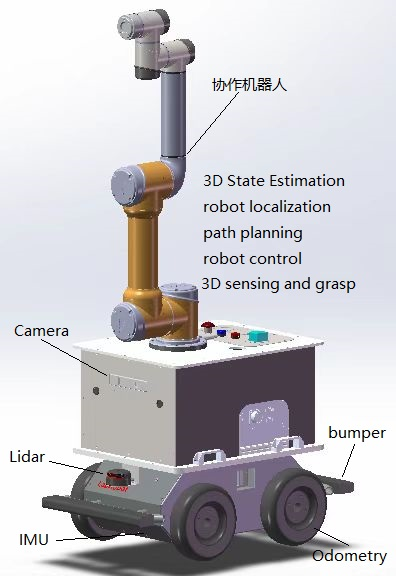
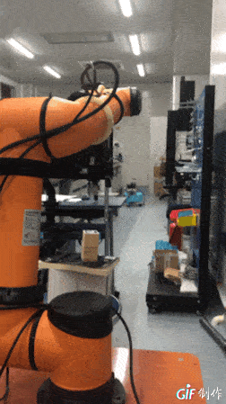

# IM(Intelligent Manufacture) Robot

This robot is combine car with arm.

-----------------------------------

  author: 南山二毛

  school: 清华大学精密仪器系

-----------------------------------



   


## 1 car Simulation

### 1.1 navigation
navigation and avoid obstacles by ros move base
```
roslaunch thurobot thurobot_laser_nav_gazebo.launch 
roslaunch thurobot nav_cloister_demo_sim.launch
roslaunch thurobot thurobot_teleop.launch
```
 
### 1.2 exploring slam
```
roslaunch thurobot thurobot_laser_nav_gazebo.launch
roslaunch thurobot exploring_slam_demo.launch
rosrun thurobot exploring_slam_sim.py 
```

## 2 Testing on actrual robot


```
roslaunch thurobot bringup.launch 
```

You need to change linear_scale parameter in bringup.launch file.(I set as 1.0)


## 3 aubo arm control 

包含模块：

[aubo_arm_usr](https://github.com/MRwangmaomao/aubo_arm_usr)

[aubo_robot](https://github.com/MRwangmaomao/aubo_robot)

[dh_hand_driver](https://github.com/MRwangmaomao/dh_hand_driver)

[dh_hand_driver](https://github.com/MRwangmaomao/dh_hand_driver)

[apriltag_ros](https://github.com/MRwangmaomao/apriltag_ros)
 
```
roslaunch auboi5_moveit_config demo.launch sim:=true
```

Then select "Interact" and move the end-effector to a new goal.

In "Motion Planning" -> "Plan and Execute" to send trajectory to the sim robot

Exit RViz and Ctrl-C the demo.launch window

 
 
## 6 remote and establish map
包含ros包：

rplidar_a3

[cartographer_ros](https://github.com/MRwangmaomao/cartographer_ros)

thurobot 

teleop_twist_keyboard

##### cartographer建立地图
```
roslaunch thurobot cartographer_slam.launch
```

##### gmapping建立地图
```
roslaunch thurobot lidar_slam.launch
```

## 7 navigation by map
```
roslaunch thurobot navigate_multi.launch
```

## 8 automatic map
```
roslaunch thurobot auto_slam.launch
```

